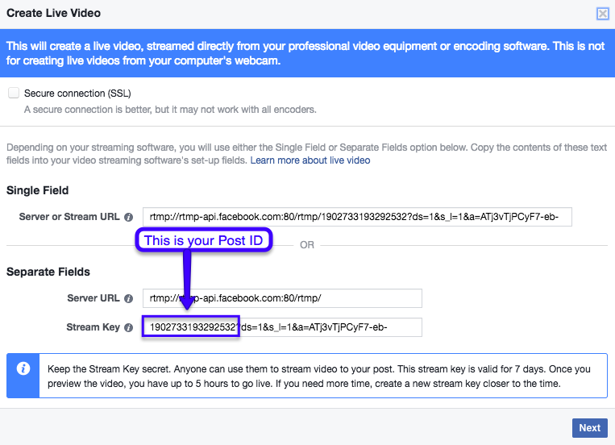

#manngoReactions
Show in realtime Facebook Reactions from a live streaming video

##How to use
```javascript
var mangoReactions = require('mango-reactions');

var options = {
    "postID": 12345678910, //The live straming post ID
    "access_token": "YOUR FACEBOOK ACCESS TOKEN HERE",
    "callback": callbackFunction
};

var reactions = new mangoReactions(options);

function callbackFunction(data) {
    console.log(data);
    //This will print a object like
    //{"LIKE": 3, "LOVE": 1, "WOW√: 3, "HAHA": 2}
}
```

###Options
**callback** _required_

This is the function that will be called every time the script runs

**postID** _required_

The Facebook post ID from the streaming video (see bellow)

**access_token** _required_

Your Facebook valid Access Token (see bellow)

**refreshTime**

Amount in seconds that the code will run to update the values. 
Default is **5 seconds**.

**defaultCount**

If you want to start with a minimum value of reactions to trick your users
Default is **0 (zero)**.


##How to start a live video
I recommend you read this tutorial on how to start a streaming. It's very easy using the OBS App.
https://obsproject.com/forum/resources/how-to-stream-to-facebook-live.391/

##How to get the post ID
 